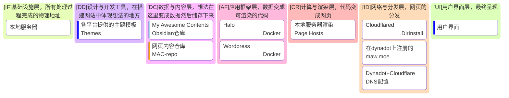

## 当前网站组件状态

## 注意：静态站建站工程暂停，此标题下的内容暂停使用（并被折叠）
---
### AF

| 功能角色 \ 发展路线   | `[!!none\|Kiln\|var(--color-cyan-rgb)]` | `[!!none\|Publii\|var(--color-cyan-rgb)]` | `[!!none\|Primo\|var(--color-cyan-rgb)]` | `[!!none\|MkDocs\|var(--color-yellow-rgb)]` | `[!!none\|Pelican\|var(--color-yellow-rgb)]` | `[!!none\|Hexo\|var(--color-green-rgb)]` | `[!!database\|Halo\|var(--color-blue-rgb)]`  | `[!!none\|Quartz5(NilA)\|var(--color-green-rgb)]` | `[!!none\|VitePress\|var(--color-green-rgb)]` | `[!!none\|Rspress\|var(--color-green-rgb)]` | `[!!none\|VuePress\|var(--color-green-rgb)]` | `[!!none\|Hugo\|var(--color-cyan-rgb)]` | `[!!none\|11ty\|var(--color-green-rgb)]` |
| ------------- | --------------------------------------- | ----------------------------------------- | ---------------------------------------- | ------------------------------------------- | -------------------------------------------- | ---------------------------------------- | -------------------------------------------- | ------------------------------------------------- | --------------------------------------------- | ------------------------------------------- | -------------------------------------------- | --------------------------------------- | ---------------------------------------- |
| 个人待办与状态公开看板   |                                         |                                           |                                          |                                             |                                              |                                          | `[!!database\|*Halo\|var(--color-blue-rgb)]` |                                                   |                                               |                                             |                                              |                                         |                                          |
| 文章站           | `[!!none\|Kiln\|var(--color-cyan-rgb)]` | `[!!none\|Publii\|var(--color-cyan-rgb)]` |                                          | `[!!none\|MkDocs\|var(--color-yellow-rgb)]` | `[!!none\|Pelican\|var(--color-yellow-rgb)]` | `[!!none\|Hexo\|var(--color-green-rgb)]` |                                              | `[!!none\|Quartz5(NilA)\|var(--color-green-rgb)]` |                                               |                                             |                                              | `[!!none\|Hugo\|var(--color-cyan-rgb)]` | `[!!none\|11ty\|var(--color-green-rgb)]` |
| 博客站           |                                         |                                           |                                          |                                             |                                              |                                          | `[!!database\|*Halo\|var(--color-blue-rgb)]` |                                                   |                                               |                                             |                                              |                                         |                                          |
| Web 试验站 - 技术向 |                                         |                                           |                                          |                                             |                                              | `[!!none\|Hexo\|var(--color-green-rgb)]` |                                              |                                                   | `[!!none\|VitePress\|var(--color-green-rgb)]` | `[!!none\|Rspress\|var(--color-green-rgb)]` | `[!!none\|VuePress\|var(--color-green-rgb)]` | `[!!none\|Hugo\|var(--color-cyan-rgb)]` | `[!!none\|11ty\|var(--color-green-rgb)]` |
| Web 试验站 - 设计向 |                                         | `[!!none\|Publii\|var(--color-cyan-rgb)]` | `[!!none\|Primo\|var(--color-cyan-rgb)]` |                                             |                                              |                                          | `[!!database\|*Halo\|var(--color-blue-rgb)]` |                                                   |                                               |                                             |                                              |                                         | `[!!none\|11ty\|var(--color-green-rgb)]` |
| 业务门户站         |                                         |                                           | `[!!none\|Primo\|var(--color-cyan-rgb)]` |                                             |                                              |                                          | `[!!database\|*Halo\|var(--color-blue-rgb)]` |                                                   |                                               |                                             |                                              | `[!!none\|Hugo\|var(--color-cyan-rgb)]` |                                          |
| 文档站           |                                         |                                           |                                          | `[!!none\|MkDocs\|var(--color-yellow-rgb)]` | `[!!none\|Pelican\|var(--color-yellow-rgb)]` |                                          |                                              |                                                   | `[!!none\|VitePress\|var(--color-green-rgb)]` | `[!!none\|Rspress\|var(--color-green-rgb)]` | `[!!none\|VuePress\|var(--color-green-rgb)]` | `[!!none\|Hugo\|var(--color-cyan-rgb)]` |                                          |
| 其他            |                                         |                                           |                                          |                                             |                                              |                                          |                                              |                                                   |                                               |                                             |                                              |                                         |                                          |

`[!!none|Docker|var(--color-blue-rgb)]` `[!!database|Docker|var(--color-blue-rgb)]` `[!!none|Nodejs|var(--color-green-rgb)]` `[!!database|Nodejs|var(--color-green-rgb)]` `[!!none|Python|var(--color-yellow-rgb)]` `[!!database|Python|var(--color-yellow-rgb)]` `[!!none|PHP|var(--color-purple-rgb)]` `[!!database|PHP|var(--color-purple-rgb)]` `[!!none|DirInstall|var(--color-cyan-rgb)]` `[!!database|DirInstall|var(--color-cyan-rgb)]`
"\*"号(\是转义字符，不记)标志当前正在使用，无"\*"号代表等待使用，弃用将直接除名。
由于git merge的特性，一个AF层应用只能对应一个git仓库。
为了便利站点构建，CI/CD和其他动作，一个git仓库只对应一个站点（不是页面）。
一个AF层应用可以被用于多个分站的构建。

| 功能角色 \ 发展路线   | `[!!none\|Astro(NilA)\|var(--color-green-rgb)]` | `[!!none\|Docusaurus\|var(--color-green-rgb)]` | `[!!database\|PageAdmin(NilA)\|var(--color-cyan-rgb)]` | `[!!database\|WordPress\|var(--color-blue-rgb)]`  | `[!!database\|DedeCMS(NilA)\|var(--color-purple-rgb)]` | `[!!database\|Discourse(NilA)\|var(--color-blue-rgb)]` | `[!!database\|NodeBB(NilA)\|var(--color-blue-rgb)]` | `[!!database\|EmpireCMS(NilA)\|var(--color-purple-rgb)]` | `[!!none\|Gatsby\|var(--color-green-rgb)]` | `[!!none\|Nuxt\|var(--color-green-rgb)]` | `[!!none\|Next.js\|var(--color-green-rgb)]` | ??? |
| ------------- | ----------------------------------------------- | ---------------------------------------------- | ------------------------------------------------------ | ------------------------------------------------- | ------------------------------------------------------ | ------------------------------------------------------ | --------------------------------------------------- | -------------------------------------------------------- | ------------------------------------------ | ---------------------------------------- | ------------------------------------------- | --- |
| 个人待办与状态公开看板   |                                                 |                                                |                                                        | `[!!database\|*WordPress\|var(--color-blue-rgb)]` |                                                        | `[!!database\|Discourse(NilA)\|var(--color-blue-rgb)]` | `[!!database\|NodeBB(NilA)\|var(--color-blue-rgb)]` |                                                          |                                            | `[!!none\|Nuxt\|var(--color-green-rgb)]` | `[!!none\|Next.js\|var(--color-green-rgb)]` | ??? |
| 文章站           | `[!!none\|Astro(NilA)\|var(--color-green-rgb)]` |                                                |                                                        | `[!!database\|*WordPress\|var(--color-blue-rgb)]` |                                                        |                                                        |                                                     |                                                          | `[!!none\|Gatsby\|var(--color-green-rgb)]` | `[!!none\|Nuxt\|var(--color-green-rgb)]` | `[!!none\|Next.js\|var(--color-green-rgb)]` | ??? |
| 博客站           |                                                 |                                                | `[!!database\|PageAdmin(NilA)\|var(--color-cyan-rgb)]` | `[!!database\|*WordPress\|var(--color-blue-rgb)]` | `[!!database\|DedeCMS(NilA)\|var(--color-purple-rgb)]` |                                                        |                                                     | `[!!database\|EmpireCMS(NilA)\|var(--color-purple-rgb)]` |                                            | `[!!none\|Nuxt\|var(--color-green-rgb)]` | `[!!none\|Next.js\|var(--color-green-rgb)]` | ??? |
| Web 试验站 - 技术向 | `[!!none\|Astro(NilA)\|var(--color-green-rgb)]` | `[!!none\|Docusaurus\|var(--color-green-rgb)]` |                                                        |                                                   |                                                        |                                                        |                                                     |                                                          | `[!!none\|Gatsby\|var(--color-green-rgb)]` | `[!!none\|Nuxt\|var(--color-green-rgb)]` | `[!!none\|Next.js\|var(--color-green-rgb)]` | ??? |
| Web 试验站 - 设计向 | `[!!none\|Astro(NilA)\|var(--color-green-rgb)]` |                                                |                                                        | `[!!database\|*WordPress\|var(--color-blue-rgb)]` |                                                        |                                                        |                                                     |                                                          |                                            | `[!!none\|Nuxt\|var(--color-green-rgb)]` | `[!!none\|Next.js\|var(--color-green-rgb)]` | ??? |
| 业务门户站         |                                                 | `[!!none\|Docusaurus\|var(--color-green-rgb)]` | `[!!database\|PageAdmin(NilA)\|var(--color-cyan-rgb)]` | `[!!database\|*WordPress\|var(--color-blue-rgb)]` | `[!!database\|DedeCMS(NilA)\|var(--color-purple-rgb)]` |                                                        |                                                     | `[!!database\|EmpireCMS(NilA)\|var(--color-purple-rgb)]` |                                            | `[!!none\|Nuxt\|var(--color-green-rgb)]` | `[!!none\|Next.js\|var(--color-green-rgb)]` | ??? |
| 文档站           |                                                 | `[!!none\|Docusaurus\|var(--color-green-rgb)]` |                                                        |                                                   |                                                        |                                                        |                                                     |                                                          |                                            | `[!!none\|Nuxt\|var(--color-green-rgb)]` | `[!!none\|Next.js\|var(--color-green-rgb)]` | ??? |
| 其他            |                                                 |                                                |                                                        |                                                   |                                                        | `[!!database\|Discourse(NilA)\|var(--color-blue-rgb)]` | `[!!database\|NodeBB(NilA)\|var(--color-blue-rgb)]` |                                                          |                                            | `[!!none\|Nuxt\|var(--color-green-rgb)]` | `[!!none\|Next.js\|var(--color-green-rgb)]` | ??? |


---
## 版本时间线
```mermaid
gantt
	title MAW版本图
    dateFormat YY-MM-DD
    axisFormat %y-%m-%d
    
    section DD
	
    section IF
    
    section DC
    
    section AF
    
    section CR
    
    section ID
    
    section UI
    
    %% Tag: active -->future use
	%% Tag: done -->pending
	%% Tag: crit -->active
	%% Tag: milestone -->version tags
	%% Tag:  -->backup
```

