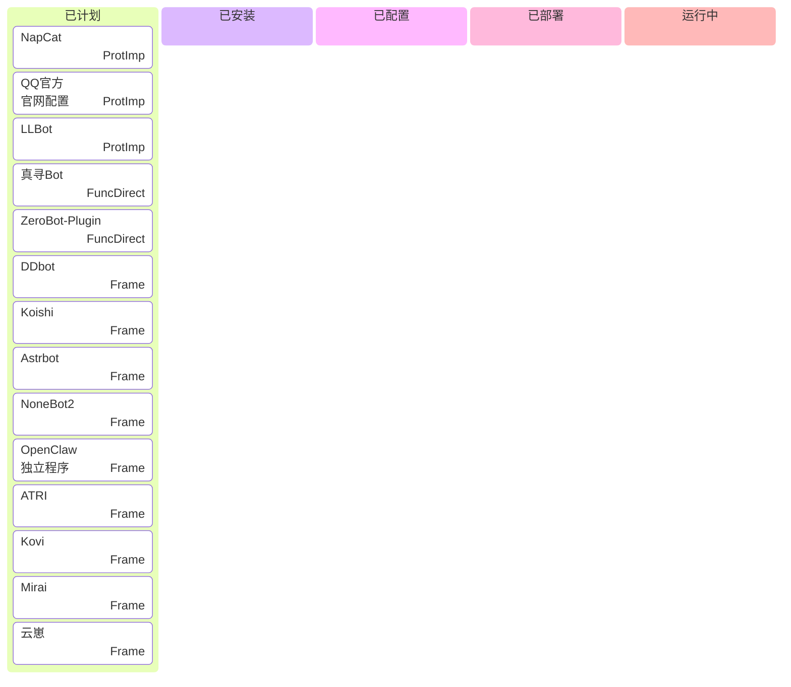
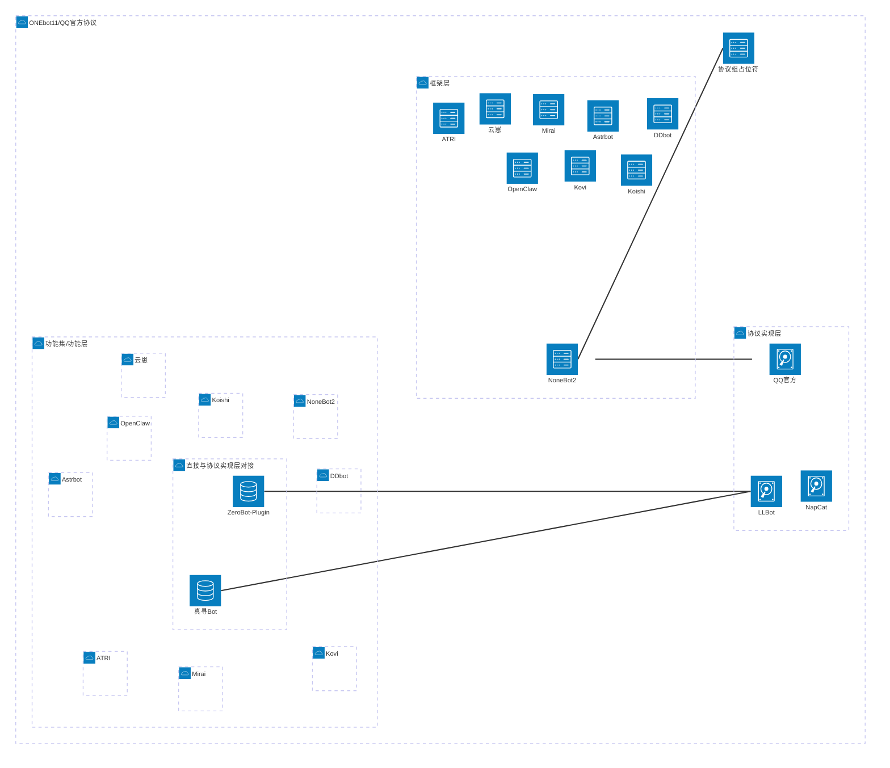
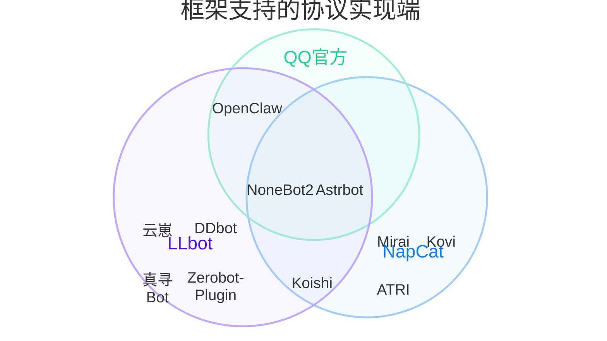

```mermaid
gantt
	title Qbot演变图
    dateFormat YY-MM-DD
    axisFormat %y-%m-%d
    
    section 功能集层
    %% 单独的功能（插件）太多了，不记了喵
       
    section 框架层
    
    section 协议实现层
    
    
    %% Tag: active -->future use
	%% Tag: done -->pending
	%% Tag: crit -->active
	%% Tag: milestone -->version tags
	%% Tag:  -->backup
```